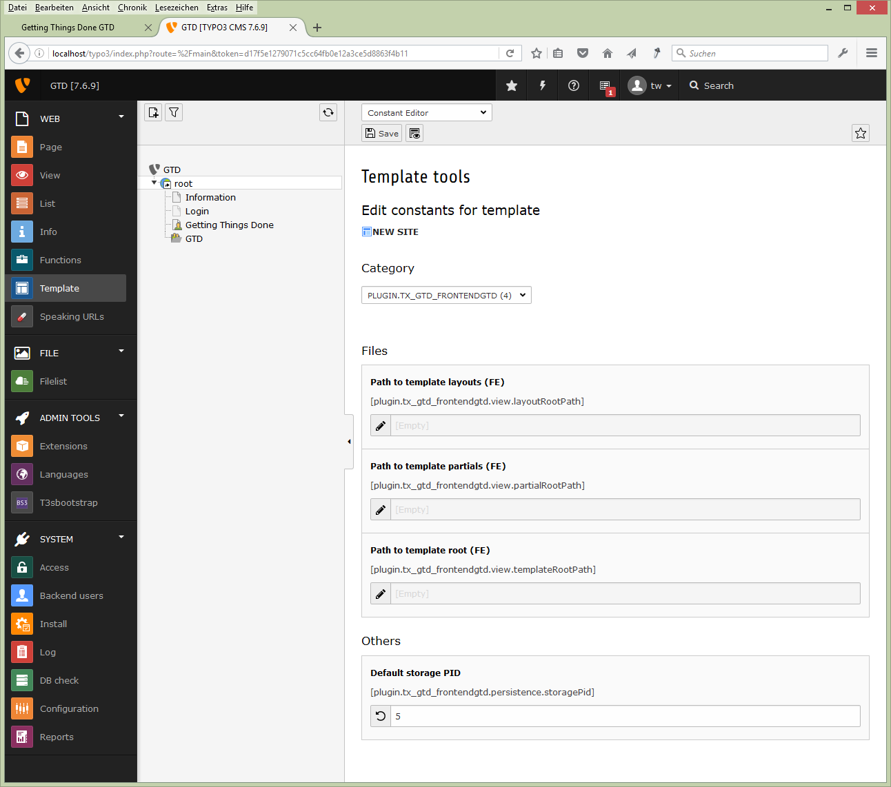
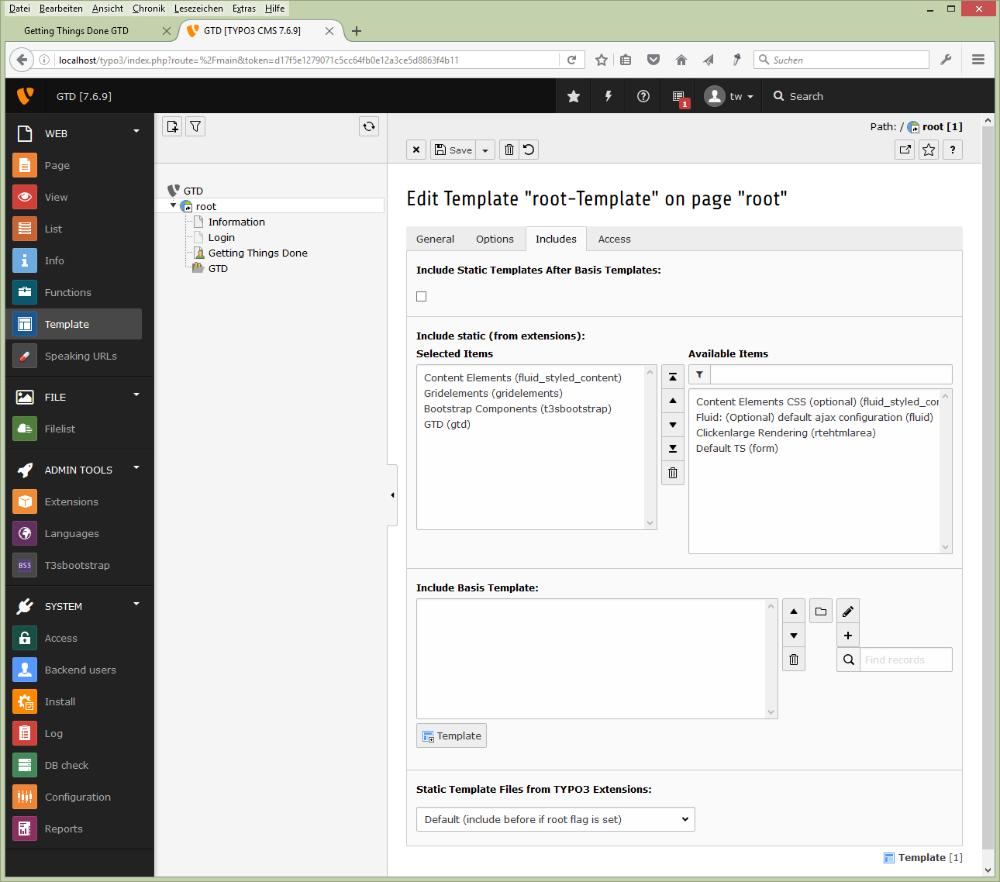
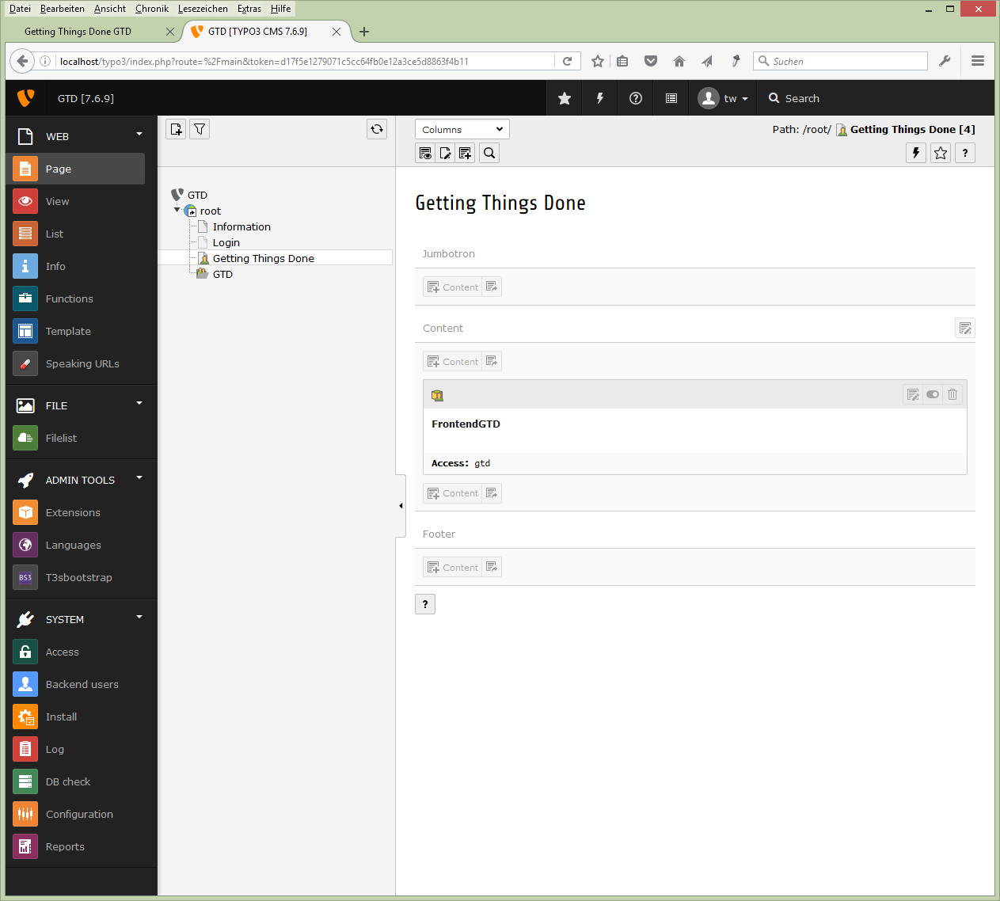
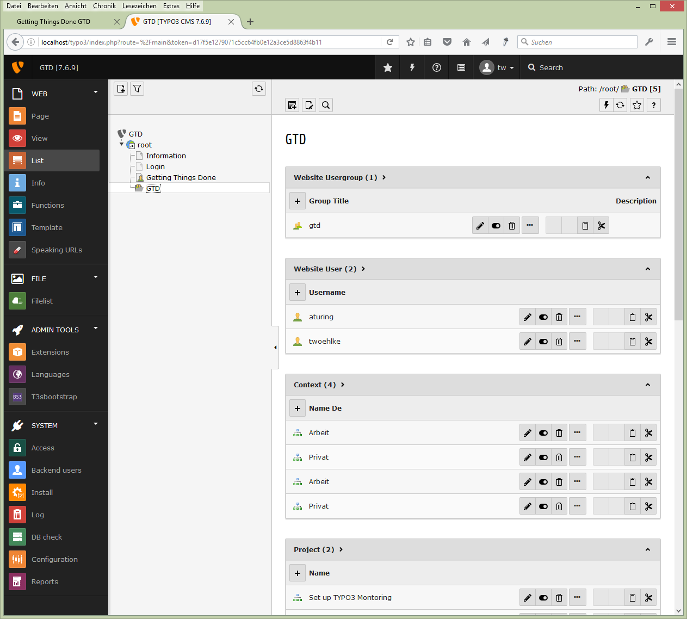
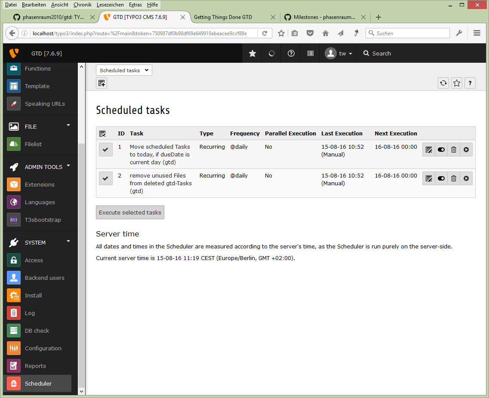

.. ==================================================
.. FOR YOUR INFORMATION
.. --------------------------------------------------
.. -*- coding: utf-8 -*- with BOM.

.. include:: ../Includes.txt

.. _admin-manual:

Administrator Manual
====================

Target group: **Administrators**

Describes how to manage the extension from an administrator point of view.
That relates to Page/User TSconfig, permissions, configuration etc.,
which administrator level users have access to.

.. _admin-installation:

Requirements
------------

- TYPO3 8.7 LTS or 9.5 LTS
- Twitter Bootstrap 3 http://getbootstrap.com/
   - I used the Extension t3sbootstrap: http://www.t3sbootstrap.de/
- An Extension for User Selfcare is Recommended. e.g.:
   - femanager https://typo3.org/extensions/repository/view/femanager
   - sr_feuser_register https://typo3.org/extensions/repository/view/sr_feuser_register

Installation
------------

To install the extension, perform the following steps:

#. Install and configure the Requirements
#. Install gtd from TER
#. Create two pages: A Login Page and the Page for gtd-Plugin
#. Create a Folder where the Users and the gtd-Data will be stored
#. Create a usergroup for gtd, maybe it is good to create a testuser
#. Include the static Template
#. Configure the Template
#. Add the two Cronjobs to the Scheduler

configuration options:

Template: Constant-Editor
  plugin.tx_t3gtd_frontendgtd.persistence.storagePid = <PID of Data Folder>
  Needed for the GTD-plugin to find the Folder with the Data and Users.

Template: Setup (TypoScript)
  config.moveJsFromHeaderToFooter = 1
  The Extension uses jQuery-ui, this option is for loading jQuery before jQuery-ui

   Constants-Editor

   Set plugin.tx_t3gtd_frontendgtd.persistence.storagePid to the PID of your Data Folder

   Include the static Template

   You need to Include the static Template, it contains TypoScript, JavaScript and CSS for the Plugin.

   Plugin

   The plugin runs this Application in the Frontend.

   Data Folder

   List of Frontend-Users and Frontend-Usergroups and also all the gtd-Data.

   Cronjobs for Scheduled Tasks

   There are two Cronjobs for the TYPO3-Scheduler (New in 0.10.0) Move scheduled Tasks to today, if dueDate is current day and remove unused Files from deleted gtd-Tasks

.. _admin-configuration:

Configuration
-------------

* The Extension is to be configured with the Constant-Editor and with TypoScript.

* The prerequisite to full fill beforehand:
  The two pages Login and gtd-plugin has to be configured to be accessable to the users in the gtd-Folder.
  I used the Extension t3sbootstrap to configure the Login.

.. _admin-faq:

FAQ
---

Yet to come: FAQ

Subsection
^^^^^^^^^^

Some subsection

Sub-subsection
""""""""""""""

Deeper into the structure...
