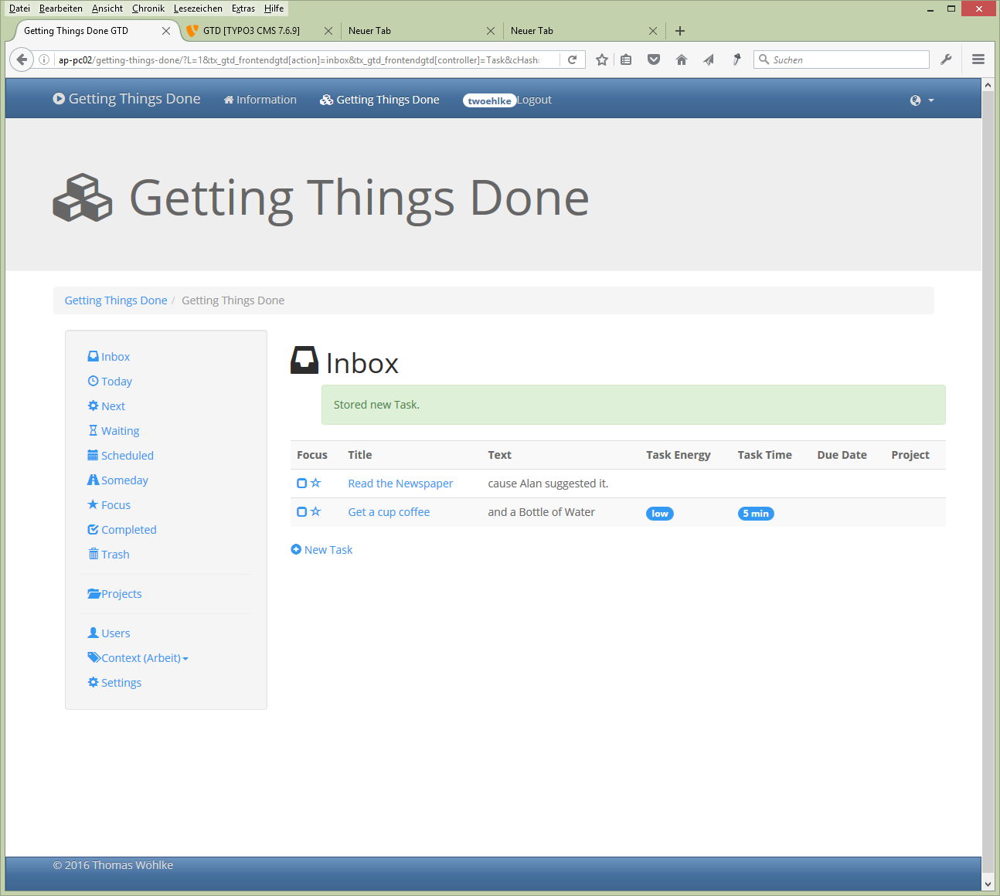

.. ==================================================
.. FOR YOUR INFORMATION
.. --------------------------------------------------
.. -*- coding: utf-8 -*- with BOM.

.. include:: ../Includes.txt

.. _introduction:

Introduction
============

.. _what-it-does:

What does it do?
----------------

TYPO3 Frontend Users can use this Extension as Todo List for Timemanagement or Projectmanangement with the Getting Things Done Scheme introduced by David Allen.
Please refer to Users Manual.

David Allen wrote the Book "Getting Things Done - The Art of Stress-free productivity".
More info about it: http://gettingthingsdone.com/

More Info about GTD: https://en.wikipedia.org/wiki/Getting_Things_Done

.. important::
   GTD® and Getting Things Done® are registered trademarks of the David Allen Company;
   But gtd TYPO3 Extension is not affiliated with or endorsed by the David Allen Company and it fully supports the same GNU Public License GPL as TYPO3 itself.

.. _screenshots:

Screenshots
-----------

Here are some Screenshots:

   Inbox

   You start collecting Tasks in Inbox

.. figure:: ../Images/06-Projekte.png
   :width: 500px
   :alt: Projects

   Projects

   Tasks can also be ordered in Projects. Projects may have subprojects.

