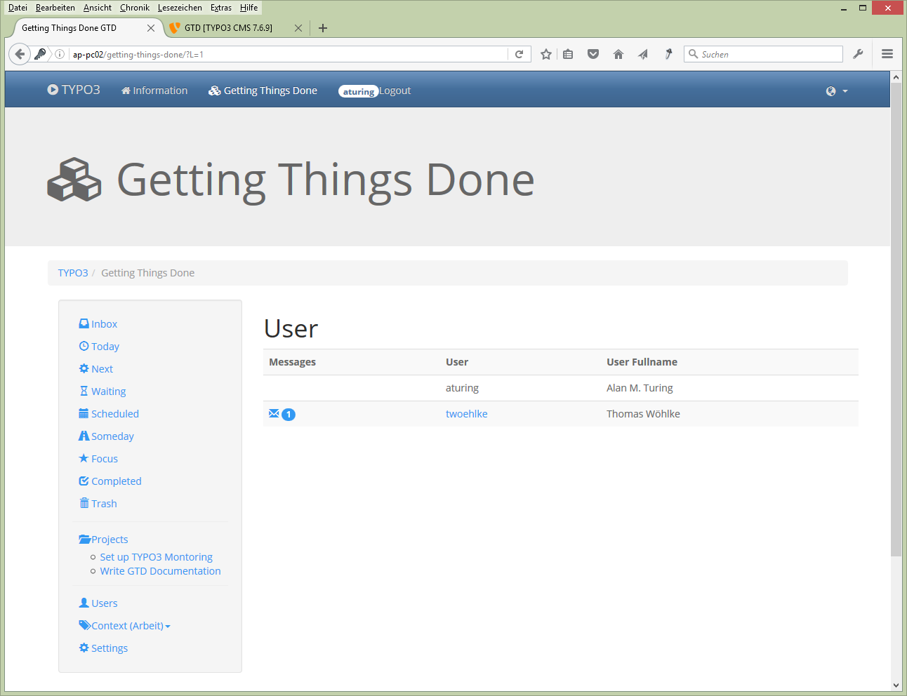
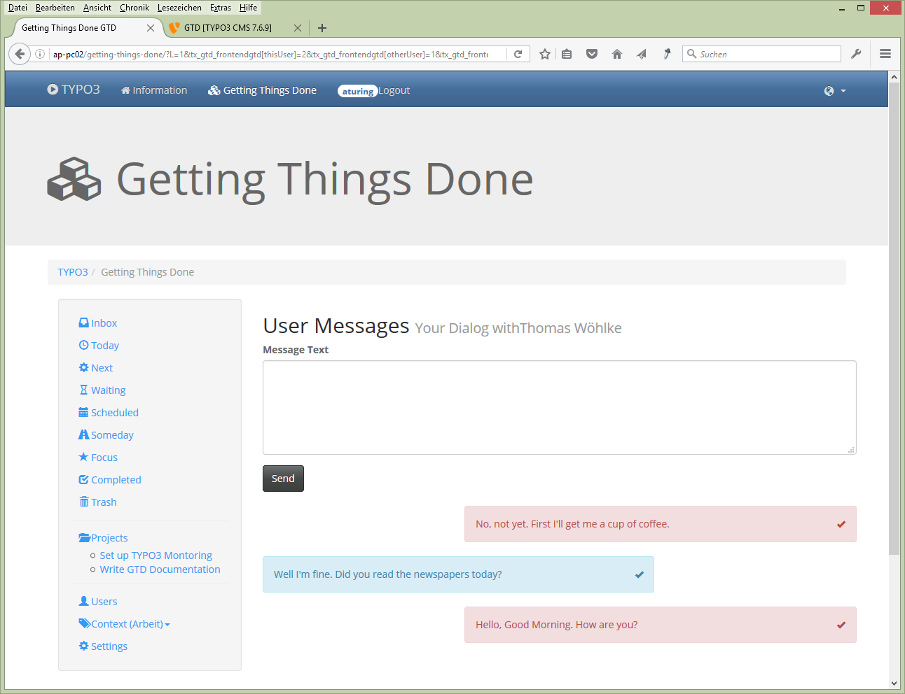
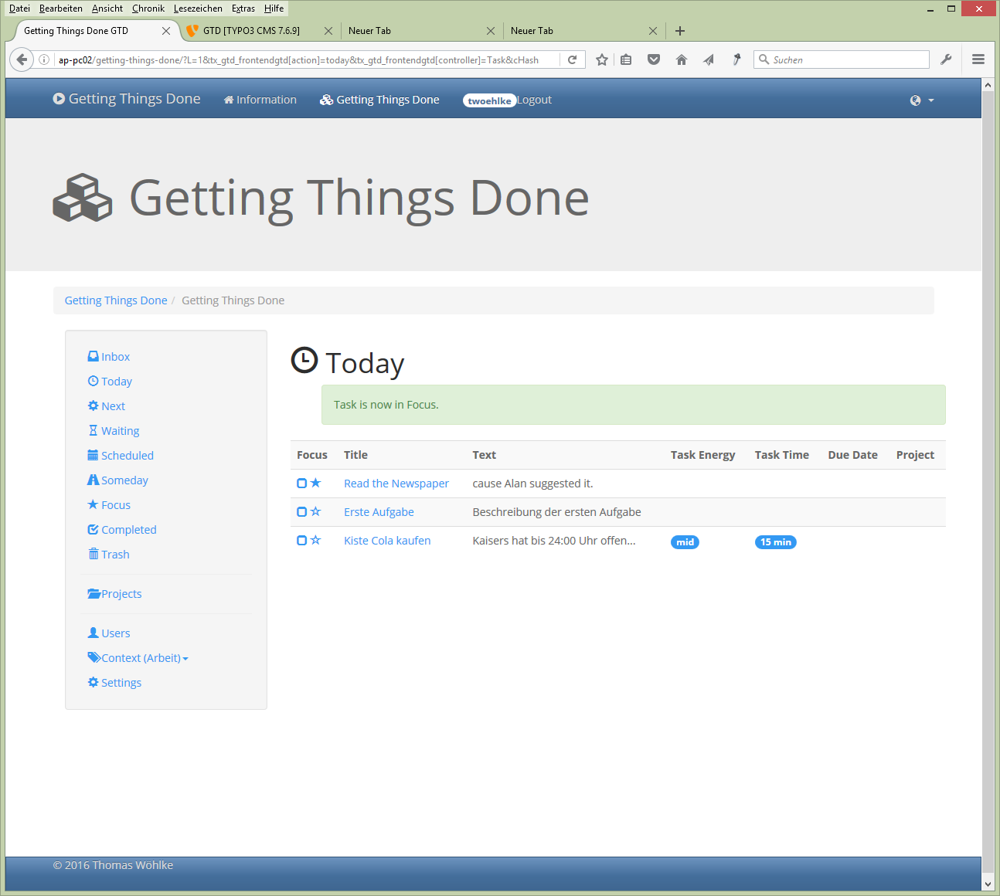
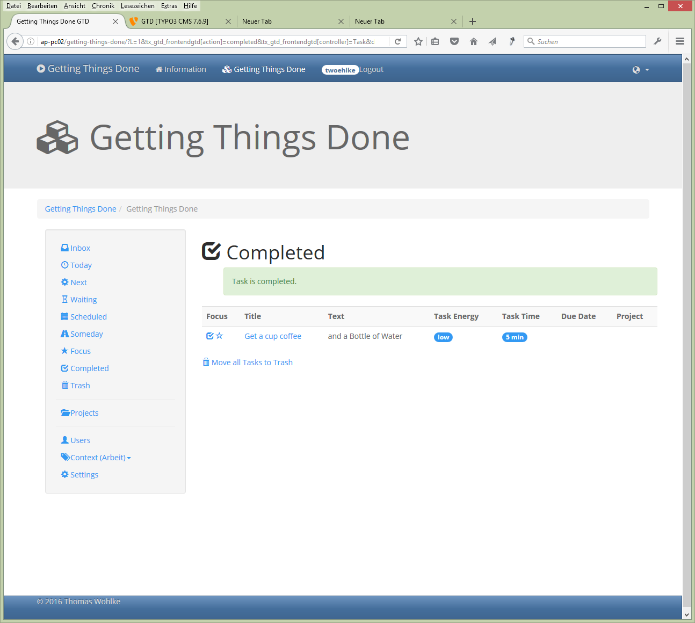
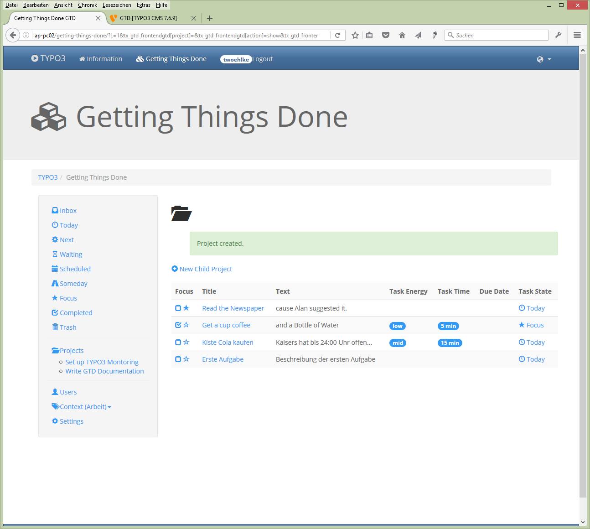
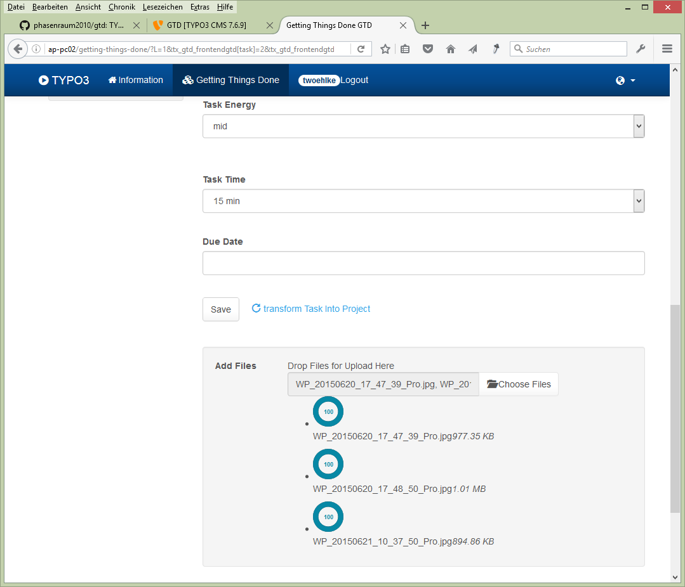

.. ==================================================
.. FOR YOUR INFORMATION
.. --------------------------------------------------
.. -*- coding: utf-8 -*- with BOM.

.. include:: ../Includes.txt

.. _user-manual:

Users Manual
============

Target group: **Website Users**

You collect Tasks to do and order them by State and into Projects.

- How does it work?

  - First you have to log in with your user credentials.

  - Then you see a List of Users. You may send messages to each other.

- How to work with Tasks

  - You start processing your Tasks in Inbox. **Here you create new Tasks.**

  - You change State of a Task by drag and drop to a List e.g. Today

  - A new Task is always on Top. You may change the Ordering in a Tasklist or Project by drag and drop Tasks inside the List.

  - If you enter a Due Date then the Task is moved to the List Scheduled

  - If you check the Star the Task will also be listed in the Focus List

  - If the Task is done, check the checkbox and the Task will be moved to the Completed List

  - If you plan to delete completed Tasks just click "Move all Tasks to Trash" in Completed List

  - In Trash you can delete all Tasks there

  - If Due Date is the current Date, then the Task will be moved to Tasklist Today

  - You can add Files to a Task by Upload and via Drag and Drop (New in 0.10.0)

- How to Work with Projects

  - Additionally to the Task State Lists you may order Tasks into Projects

  - Projects may have Sub-Projects

  - To add a Task to a Project just Drag and Drop

  - You may transform a Task into a Project

- Work with Context

  - you may choose a Context. e.g. Work and Private

  - Projects and Tasks belong to one of the Contexts

  - You may create more Contexts in the Settings

- Settings:

  - Here you can set the default Context with what you will start after Login. You also can change the List of Contexts here.

.. tip::

   Drag and Drop forces the page to reload, sometimes it is good to be a little bit patience.

.. important::

   You should read the Book "Getting Things Done" by David Allen: http://gettingthingsdone.com/
   There is a Wikipedia Article: https://en.wikipedia.org/wiki/Getting_Things_Done
   GTD® and Getting Things Done® are registered trademarks of the David Allen Company.
   GTD TYPO3 Extension is not affiliated with or endorsed by the David Allen Company.

Here are some **Screenshots** for the first impression:
-------------------------------------------------------

   Communication between Users

   Users can Send Messages to each other

   Message Talk between two Users

   Users can Send Messages to each other

.. figure:: ../Images/03-Inbox.png
   :width: 500px
   :alt: Inbox

   Inbox

   You start collecting Tasks in Inbox

   Today

   Choose Tasks you want to solve today and move them to Today List by Drag and Drop

   Completed

   If a Task is done, you hit the checkbox and the Task is moved to the Completed List

   Projects

   Tasks can also be ordered in Projects. Projects may have subprojects.

   Files for Task

   You can add Files to a Task by Upload and via Drag and Drop. (New in 0.10.0)

.. _user-faq:

FAQ
---

Yet to come: FAQ
